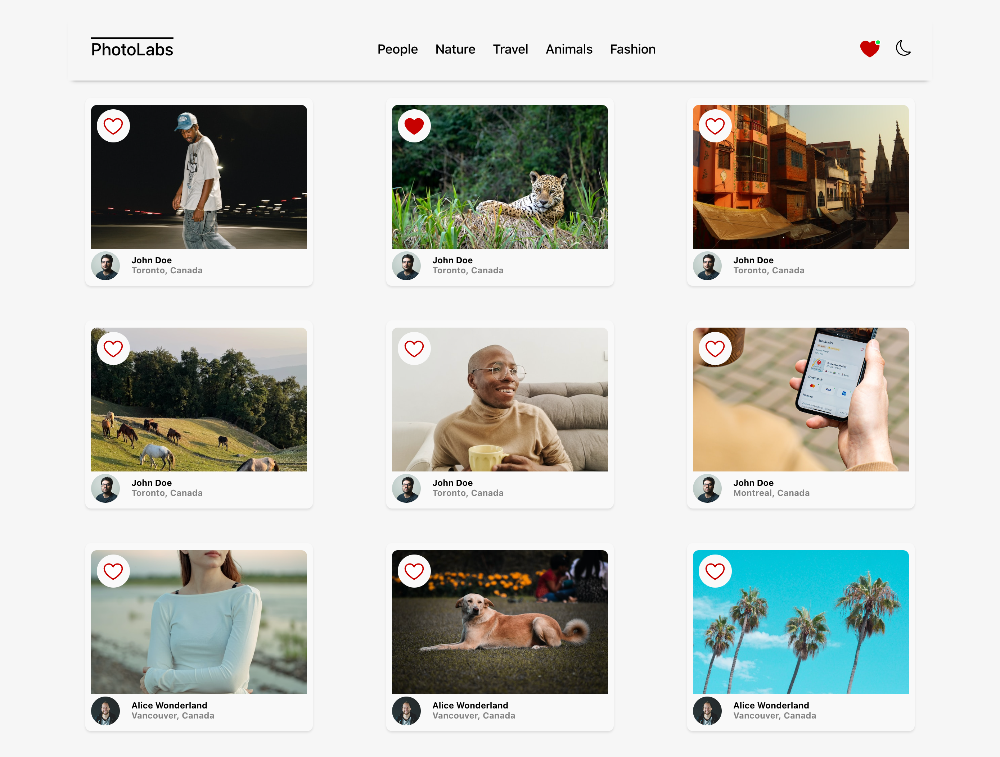
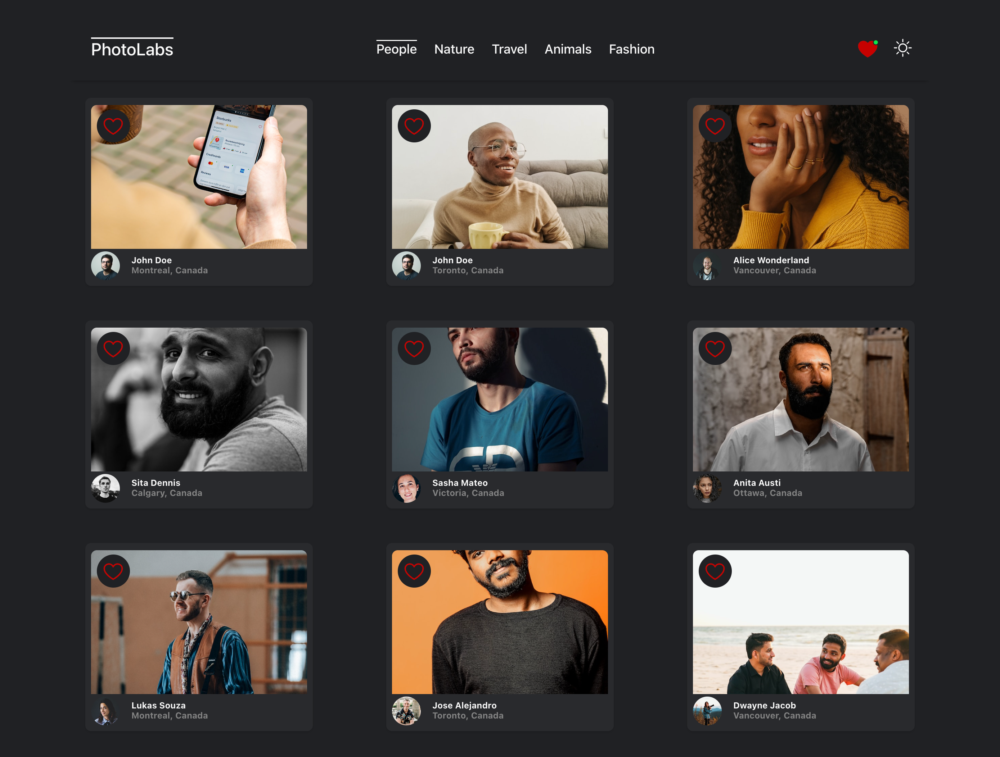
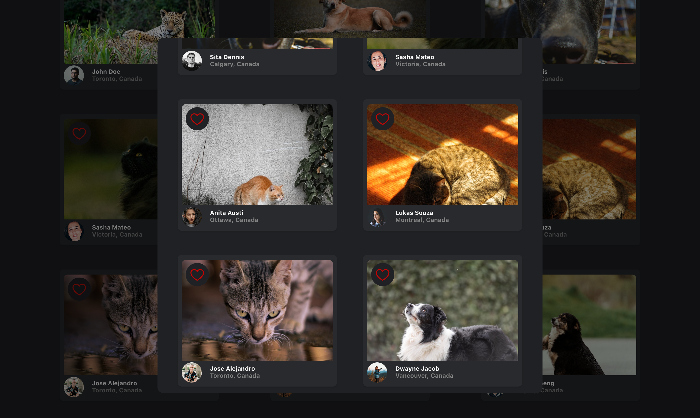

# PhotoLabs
PhotoLabs is a React-based single-page application (SPA) that allows users to view photos in different contexts. 

## Purpose

This project was built as a part of my learnings at [Lighthouse Labs](https://www.lighthouselabs.ca).

## Final Product
View of Home Page with Liked Notification in Light Mode



View of Photos Filtered by People Topic in Dark Mode



View One Photo in Light Mode


View Similar Photos in Dark Mode



## Features
- Users can toggle Light and Dark mode with sun and moon icons
- Users can click on PhotoLabs logo to view all photos in application
- Users can like an individual photo from anywhere within the application where the photo is displayed
- Users can view a heart icon with a notification in the navigation if there are liked photos
- Users can click on a photo to view a larger version of the photo and relevant / similar photos
- Users can navigate to view photos categorized by different topics

## Setup

Install dependencies with `npm install` in each respective `/frontend` and `/backend`.

## [Frontend] Running Webpack Development Server

```sh
cd frontend
npm start
```

## [Backend] Running Backend Servier

Read `backend/readme` for further setup details.

```sh
cd backend
npm start
```

## Dependencies

- [React](https://react.dev)
- [Express](https://expressjs.com)
- [Node.js](https://nodejs.org)
- [Babel](https://babeljs.io/)
- [SASS](https://www.npmjs.com/package/sass)